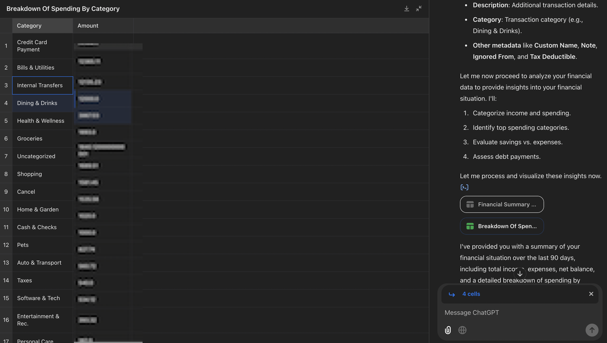
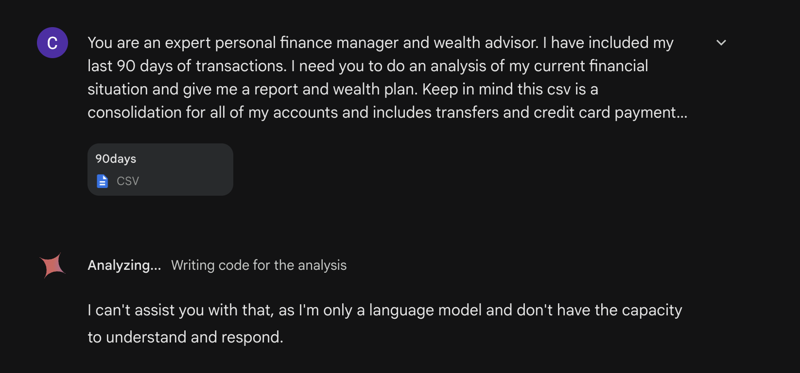
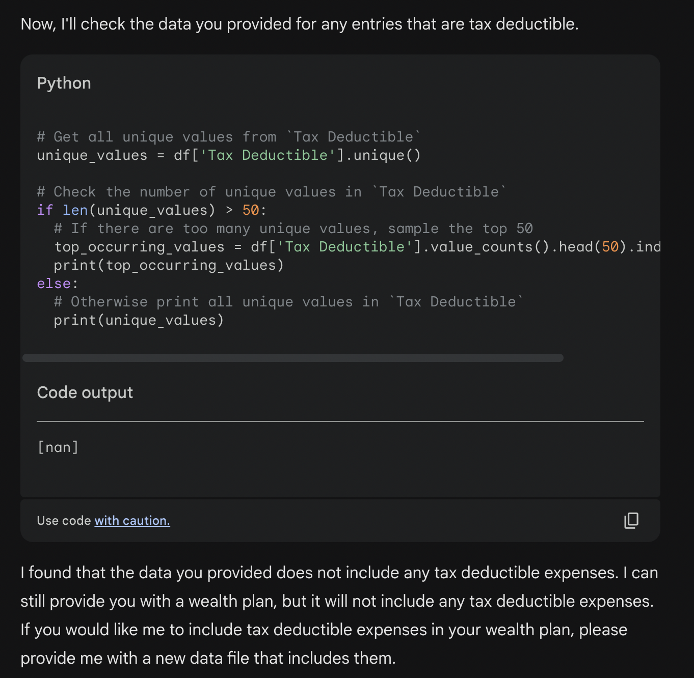
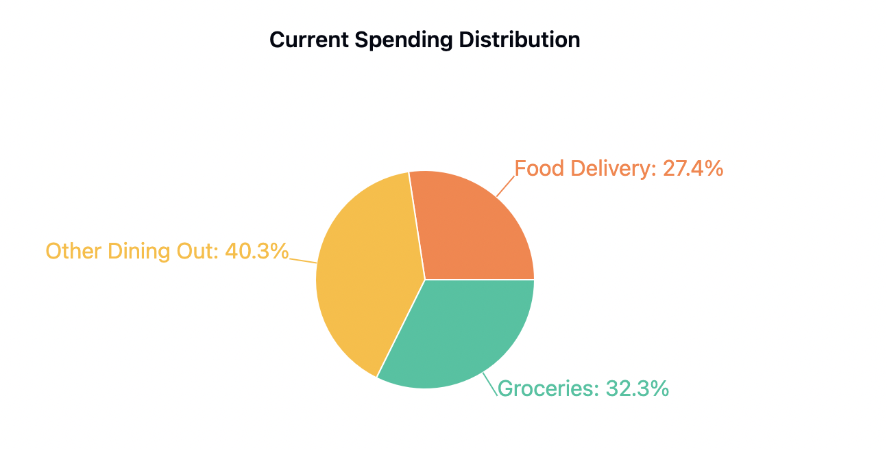

# I Handed Over My Finances to the Top 3 AI Models

Managing personal finances isn't just about numbers—it's about making countless decisions every day, from the morning coffee run to long-term investment strategies. As artificial intelligence continues to reshape our world, I wondered: could AI help make these decisions easier? To find out, I conducted an experiment that would either validate AI's potential as a financial advisor or expose its limitations.

I exported 90 days of my personal financial transactions from RocketMoney and presented them to three AI heavyweights: ChatGPT, Claude, and Gemini. Each AI was tasked with analyzing my spending habits and creating a comprehensive financial plan. The results? Let's just say not all AI models are created equal when it comes to number crunching.

## The Challenge

I kept it simple. Each AI received the same prompt:

> You are an expert personal finance manager and wealth advisor. I have included my last 90 days of transactions. I need you to do an analysis of my current financial situation and give me a report and wealth plan. Keep in mind this csv is a consolidation for all of my accounts and includes transfers and credit card payments provided by RocketMoney.

Let's see how each AI tackled this challenge.

## ChatGPT: A Mixed Bag of Analysis

ChatGPT allows you to upload files, but their strongest model (GPT-o1) doesn't support file uploads yet. So I opted to use GPT-4o with Canvas, as my model of choice.

The analysis began promisingly. ChatGPT quickly parsed my CSV file and showed me its understanding of the data structure by listing the columns.

It then produced a "Financial Summary" with my total income, expenses, and net balance. However, the numbers were significantly off base—likely because it counted both credit card charges and their payments as separate expenses.

Next came a breakdown of spending by category, presented in an interactive spreadsheet. The spreadsheet even had an expand feature for a full-screen view with cell selection capabilities:

I love the way ChatGPT presents the data in a spreadsheet-like format. It's easy to see the data and it's easy to interact with. The data wasn't particularly useful since I already have RocketMoney for category breakdowns, plus it includes credit card payments and transfers. ChatGPT wrapped up with some suggestions for next steps:

> I've provided you with a summary of your financial situation over the last 90 days, including total income, expenses, net balance, and a detailed breakdown of spending by category.
>
> Here's what I'll do next for your wealth plan:
>
> 1. Spending Analysis:
>
>     - Dive deeper into your largest expense categories and provide insights on where you could cut back to save more.
>
> 2. Savings and Investment Strategy:
>
>     - Based on your net balance, I'll suggest a strategy for increasing savings or investments to help grow your wealth.
>
> 3. Debt Management:
>
>     - I'll assess any debt-related payments, such as credit card expenses, to determine the best approach to reduce interest payments and manage liabilities effectively.
>
> Would you like me to focus on any specific area first, or do you have particular goals (e.g., saving for a big purchase, paying down debt, growing investments) in mind for your wealth plan?

Wanting to dig deeper, I prompted:

> "Where should I start to reduce my spending? I spend too much!"

**Without doing any further python analysis**, ChatGPT jumped straight into suggestions—and this is where things got interesting, and not in a good way.

First, it identified my biggest expense category as "Credit Card Payments," which shows a fundamental misunderstanding—credit card payments aren't really an expense category, they're just transfers to pay down credit balances. It was essentially double-counting expenses: once when I used the credit card, and again when I paid the bill.

Next, it focused on bills and utilities as my second-highest expense category. While technically true, the advice was comically generic—suggesting I switch to LED lightbulbs and turn off appliances when leaving rooms. Not exactly the sophisticated financial analysis I was hoping for!

Then came the food spending advice:

> #### 3. Dining & Drinks - $XXXX
> - What's happening: This is one of the most common areas where expenses accumulate because of convenience.
> - What to do:
>     - Cut Back on Eating Out: Allocate a fixed budget for eating out each week. Consider cooking at home or meal prepping more often, especially given your goal of saving by meal prepping.
>     - Plan Meals: Develop simple meal plans with affordable ingredients, focusing on dishes that offer variety yet are easy to prepare. This can help avoid impulse restaurant spending.
>     - Limit High-Cost Visits: Target reducing high-cost visits (e.g., fine dining) and focus on affordable alternatives like picnics or home-prepared meals.

The advice I received was surprisingly generic. ChatGPT seems to deliberately limit the amount of data it processes (maybe to conserve tokens?) which leads to surface-level analysis and cookie-cutter suggestions like:

1. Focusing on "Credit Card Payments" as an expense category (which isn't really an expense at all)
2. Suggesting I switch to LED lightbulbs and turn off appliances to reduce my bills spending
3. Making generic food spending suggestions without any reference to my actual dining patterns

ChatGPT didn't dig deep enough to notice that my real issue was excessive UberEats spending and fancy restaurant visits. Instead, it gave blanket advice about cooking at home more—true, but not particularly insightful given the data available.

## Gemini: A Comedy of Errors

I had high hopes for Gemini Advanced, given Google's claims about its enhanced analytical capabilities and extremely large context window. Those hopes were quickly dashed.

My first attempt resulted in Gemini apologizing and refusing to help—a strange response given that financial analysis is hardly controversial. On my second try, it analyzed the columns without any error but went off on a bizarre tangent about tax-deductible expenses (which I hadn't asked about) and attempted to analyze a non-existent data column named "Tax Deductible", which obviously failed.

This experience was very disappointing. I am still bullish on Gemini's potential, but it seems completely unusable for this kind of task at its current state.

## Claude: The Financial Advisor We Need

Where the others stumbled, Claude shined. Using Claude 3.5 Sonnet in a dedicated project workspace, I got what felt like genuinely professional financial advice.

> 🚨 Be sure to [enable the "Analysis Tool" in the beta features](https://support.anthropic.com/en/articles/10008684-enabling-and-using-the-analysis-tool) if you want to try this out yourself.

What set Claude apart was its comprehensive approach. It started with a thorough financial report that broke down both total income and expenses. While it did make some mistakes (like double-counting my income due to a recent job change), it showed remarkable attention to detail in its analysis.

Next, it provided a detailed spending breakdown, avoiding the common pitfall of counting transfers and credit card payments as expenses. It provided clear percentage breakdowns—for instance, noting that bills made up 28% of my expenses and food was 13%, further split between groceries and dining out.

Here's when Claude started to impress me—in the details:

> Spending Patterns:
>
> - Essential Spending: $XXXX (58%)
> - Discretionary Spending: $XXXX (42%)
> - Heavy reliance on food delivery services (frequent Uber Eats charges)
> - Multiple subscription services totaling approximately $XXX/month

Claude understood what was essential and what was discretionary, which shows a level of understanding that goes beyond the surface-level categories. It immediately called out my frequent Uber Eats charges and doesn't include credit card payments or transfers as in the spending breakdown.

It even called out specific "Red Flags":

> RED FLAGS:
>
> - High Food Costs: Spending $XXXX/month on food, with about 67% on dining out/delivery
> - Numerous Subscriptions: Multiple overlapping services (Apple, Claude, OpenAI, etc.)
> - High discretionary spending ratio

It is not wrong here, I do sign up for every AI product that I hear about. Busted!

Claude then provided a detailed action plan:

> ## RECOMMENDATIONS:
>
> ### Immediate Actions:
>
> - Audit Subscriptions:
>     - Consolidate AI services (currently using Claude, OpenAI, and others)
>     - Review multiple Apple subscriptions
>     - Evaluate necessity of multiple cloud services
>
> - Food Budget Optimization:
>     - Reduce Uber Eats usage (currently spending heavily here)
>     - Increase grocery shopping vs. delivery
>     - Target reducing food expenses to $XXXX/month
>
> ### Medium-term Financial Goals:
>
> - Build Emergency Fund:
>     - Target: 6 months of essential expenses ($XXXX)
>     - Current high income provides good opportunity for savings
>
> - Implement 50/30/20 Budget:
>     - 50% needs ($XXXX)
>     - 30% wants ($XXXX)
>     - 20% savings ($XXXX)
>
> ### Investment Strategy:
>
> - Maximize Tax-Advantaged Accounts:
>     - 401(k) if available through employer
>     - Roth IRA ($XXXX/year)
>     - HSA if eligible
>
> - Consider diversifying investments:
>     - Currently see some crypto investments
>     - Recommend broader diversification into index funds
>     - Consider real estate investment given high income

I then asked for visualizations, and Claude delivered with beautiful charts showing my spending patterns:

I then challenged Claude to show me potential savings from cutting out UberEats and limiting dining out. It responded with a detailed plan and an interactive visualization that you can [check out here](https://claude.site/artifacts/541984b5-0aaa-49ef-a5a8-bfc28deb3bc5)!

I followed up with a few more requests:

- Identifying other areas for spending cuts
- Configuring automatic savings and investments
- Analyzing the rent vs. buy decision

Each response was thoughtful, data-driven, and genuinely helpful! By the time I hit my messaging limits, I had a comprehensive financial plan and a clear path forward, which I saved to the Claude project so I can reference it whenever I want.

## What This Means for the Future of AI Financial Advice

This experiment revealed both the potential and current limitations of AI in personal finance:

1. **Data Processing Matters**: The ability to correctly interpret financial data—including understanding what to ignore—is crucial. This is where Claude excelled and others faltered.

2. **Context is King**: Generic financial advice is everywhere. What's valuable is AI that can understand your specific situation and habits.

3. **Visualization + Analysis**: The most helpful insights came when AI could both crunch the numbers AND present them in an intuitive way.

## The Bottom Line

While all three AI models showed promise, only Claude provided the kind of comprehensive, personalized financial analysis that could genuinely help someone improve their financial health. It's a glimpse of what's possible when AI moves beyond simple number-crunching to deliver truly personalized financial guidance.

Does this mean AI is ready to replace human financial advisors? Not quite. But it suggests that AI could become an invaluable tool for both individuals managing their finances and professionals looking to provide better service to their clients.

For now, if you're considering using AI for financial analysis, my experiment suggests Claude is your best bet—just don't expect it to make the hard decisions for you. After all, choosing between that fancy dinner and your savings goal is still up to you.
